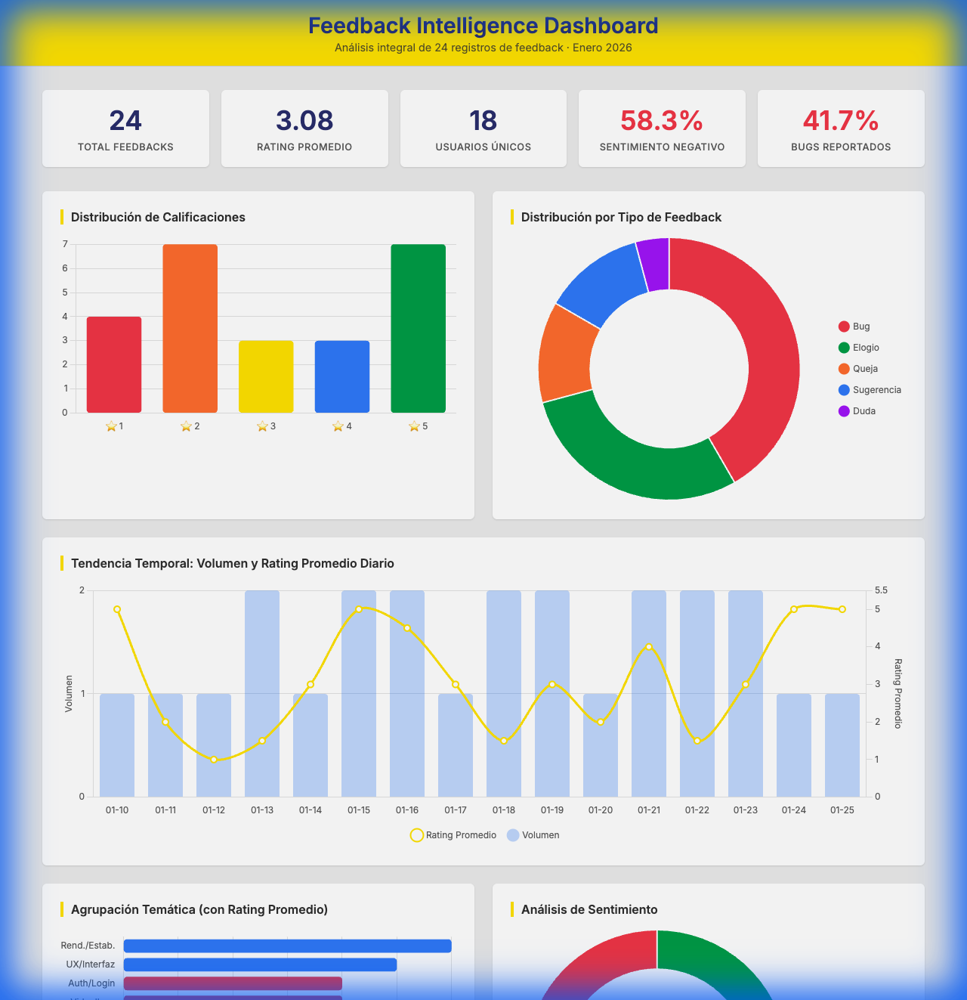

# 📊 Informe de Inteligencia de Producto — Análisis Integral de Feedback

> **Autor:** Senior Data Scientist & UX Research Specialist  
> **Fecha:** 11 de Febrero, 2026  
> **Fuente de datos:** `seed-data.json` (24 registros, Enero 2026)

---

## 1. Análisis Exploratorio de Datos (EDA)

### 1.1 Estructura de los Datos

| Campo | Tipo | Descripción | Ejemplo |
|---|---|---|---|
| `feedback_id` | `string` | Identificador único del feedback | `f-0001` |
| `user_id` | `string` | Identificador anonimizado del usuario | `u-001` |
| `feedback_type` | `string` | Categoría del feedback | `elogio`, `bug`, `queja`, `sugerencia`, `duda` |
| `rating` | `integer` | Calificación del 1 al 5 | `5` |
| `comment` | `string` | Comentario textual en español | Texto libre |
| `created_at` | `string (ISO 8601)` | Fecha de creación | `2026-01-10T09:12:11Z` |
| `updated_at` | `string (ISO 8601)` | Fecha de última actualización | `2026-01-10T09:12:11Z` |

- **Volumen:** 24 registros
- **Cobertura temporal:** 10 al 25 de enero de 2026 (16 días)
- **Valores nulos/faltantes:** 0 en todas las columnas
- **Anomalía detectada:** `created_at == updated_at` en el 100% de los registros, indicando que ningún feedback ha sido editado después de su creación

---

### 1.2 Análisis Cuantitativo

#### Distribución de Calificaciones

| Rating | Cantidad | Porcentaje |
|:---:|:---:|:---:|
| ⭐ 1 | 4 | 16.7% |
| ⭐ 2 | 7 | 29.2% |
| ⭐ 3 | 3 | 12.5% |
| ⭐ 4 | 3 | 12.5% |
| ⭐ 5 | 7 | 29.2% |

| Métrica | Valor |
|---|:---:|
| **Media** | 3.08 |
| **Mediana** | 3 |
| **Desviación estándar** | 1.50 |

> [!IMPORTANT]
> La distribución es **bimodal** con picos en ratings 2 y 5 (ambos con 29.2%), lo que indica una **polarización marcada** del sentimiento de los usuarios. El centro de la distribución (rating 3) está subrepresentado, sugiriendo que los usuarios que dan feedback tienden a estar muy satisfechos o muy insatisfechos.

#### Distribución por Tipo de Feedback

| Tipo | Cantidad | Porcentaje | Rating Promedio |
|---|:---:|:---:|:---:|
| **Bug** | 10 | 41.7% | 2.00 |
| **Elogio** | 7 | 29.2% | 4.86 |
| **Queja** | 3 | 12.5% | 1.33 |
| **Sugerencia** | 3 | 12.5% | 4.33 |
| **Duda** | 1 | 4.2% | 3.00 |

#### Análisis de Severidad y Priorización

Se calculó un puntaje de severidad usando la fórmula: `Severidad = Cantidad × (6 - Rating Promedio)`, que pondera tanto la frecuencia del problema como su impacto negativo en la experiencia del usuario.

| Tipo | Score Severidad | Cantidad | Rating Promedio | Prioridad |
|---|:---:|:---:|:---:|:---:|
| **Bug** | **40.0** | 10 | 2.00 | 🔴 Crítica |
| **Queja** | **14.0** | 3 | 1.33 | 🟡 Alta |
| **Elogio** | 8.0 | 7 | 4.86 | 🟢 Fortaleza |
| **Sugerencia** | 5.0 | 3 | 4.33 | 🔵 Oportunidad |
| **Duda** | 3.0 | 1 | 3.00 | ⚪ Baja |

#### Agrupación Temática (Clustering)

| Tema | Feedbacks | Avg Rating | Tipos predominantes |
|---|:---:|:---:|---|
| **Rendimiento/Estabilidad** | 6 | 3.67 | Bug + Elogio (opiniones divididas) |
| **UX/Interfaz** | 5 | 3.60 | Elogio + Bug + Sugerencia |
| **Autenticación/Login** | 4 | 1.75 | Bug + Queja |
| **Videollamadas** | 4 | 1.50 | Bug exclusivamente |
| **Notificaciones** | 3 | 5.00 | Elogio exclusivamente |
| **Búsqueda** | 2 | 3.00 | Bug exclusivamente |
| **Trabajo remoto** | 2 | 5.00 | Elogio exclusivamente |
| **Integraciones** | 2 | 4.50 | Sugerencia exclusivamente |
| **Soporte al cliente** | 2 | 1.50 | Queja exclusivamente |

> [!WARNING]
> **Videollamadas** y **Soporte al cliente** tienen los ratings más bajos (1.50) y representan los puntos de dolor más críticos de la plataforma. El módulo de videollamadas genera feedback exclusivamente de tipo **bug** con el rating más bajo promediado.

#### Comportamiento por Usuario (Anonimizado)

| Métrica | Valor |
|---|:---:|
| Usuarios únicos | 18 |
| Usuarios con un solo feedback | 13 (72.2%) |
| Usuarios con múltiples feedbacks | 5 (27.8%) |

**Usuarios recurrentes:**

| User ID | Feedbacks | Tipos | Ratings | Patrón |
|---|:---:|---|---|---|
| **u-008** | 3 | bug, bug, bug | 2, 1, 2 | 🔴 Frustrado — 3 bugs en videollamadas |
| **u-012** | 2 | sugerencia, sugerencia | 4, 5 | 🔵 Comprometido — pide Google Drive |
| **u-015** | 2 | queja, queja | 1, 2 | 🔴 En riesgo — quejas sobre verificación y soporte |
| **u-016** | 2 | queja, elogio | 1, 5 | ⚠️ Contradictorio — odia soporte, ama la app |
| **u-019** | 2 | bug, bug | 3, 2 | 🟡 Reporta problemas calmadamente |

> [!CAUTION]
> **u-008** representa un usuario de alto riesgo de churn: 3 reportes de bug en videollamadas en un solo día (13-ene), con ratings decrecientes (2→1→2). Acción inmediata requerida.

#### Tendencia Temporal

| Semana | Volumen | Observación |
|---|:---:|---|
| W01 (10 ene) | 2 | Inicio de datos |
| W02 (11-17 ene) | 11 | Pico principal (46% del total) |
| W03 (18-25 ene) | 11 | Volumen sostenido |

**Picos notables:**
- **13 de enero:** 2 feedbacks, ambos bugs de videollamadas (avg rating 1.5) — posible incidente de servicio
- **22 de enero:** 2 feedbacks, ambos bugs de videollamadas (avg rating 1.5) — segundo incidente potencial
- **15-16 enero:** 4 feedbacks positivos consecutivos (avg rating 4.75) — evidencia fortalezas del producto

#### Correlaciones y Contradicciones

**Longitud de comentario vs. Rating:**

| Rating | Longitud Promedio (caracteres) |
|:---:|:---:|
| 1 | 61 |
| 2 | 65 |
| 3 | 61 |
| 4 | 57 |
| 5 | 60 |

> No se detectó correlación significativa entre longitud de comentario y rating. Los comentarios son consistentemente breves (~60 caracteres) independientemente del sentimiento.

**Contradicción destacada:**
- **u-016:** Rating 1 (queja sobre soporte) + Rating 5 (elogio a la app móvil). Esto indica que la calidad del producto es alta, pero la capa de **servicio al cliente** es un punto de falla independiente.

---

### 1.3 Análisis Cualitativo (NLP)

#### Palabras Clave Más Frecuentes

| Palabra | Frecuencia | Contexto |
|---|:---:|---|
| **videollamadas** | 3 | Todas negativas (bugs) |
| **falla** | 3 | Asociado a verificación y calidad |
| **excelente** | 2 | Elogios a navegación y trabajo remoto |
| **rápida** | 2 | Elogios a velocidad |
| **notificaciones** | 2 | Siempre positivo |
| **google/drive** | 2+2 | Solicitud de integración |
| **soporte** | 2 | Siempre negativo |
| **tema/oscuro** | 2+2 | Sugerencia + bug |
| **búsqueda** | 2 | Reportes de lentitud y errores |

#### Categorización de Quejas y Elogios

**Quejas principales (13 feedbacks negativos):**
1. 🔴 **Videollamadas inestables** — cortes, eco, fallo con +3 personas (4 feedbacks)
2. 🔴 **Problemas de autenticación** — desconexiones, 2FA fallido, pérdida de sesión (4 feedbacks)
3. 🟡 **Soporte deficiente** — tickets sin responder, demora en resolución (2 feedbacks)
4. 🟡 **Búsqueda defectuosa** — lentitud y resultados incorrectos (2 feedbacks)
5. ⚪ **Bug visual** — textos ilegibles en tema oscuro (1 feedback)

**Elogios principales (9 feedbacks positivos):**
1. 🟢 **Notificaciones** — automáticas, puntuales, útiles (3 feedbacks)
2. 🟢 **Navegación e interfaz** — intuitiva, rápida, fácil de usar (2 feedbacks)
3. 🟢 **App móvil** — rapidez, estabilidad (1 feedback)
4. 🟢 **Trabajo remoto** — sincronización confiable (1 feedback)

#### Análisis de Sentimiento

| Sentimiento | Cantidad | Porcentaje | Rating Promedio |
|---|:---:|:---:|:---:|
| **Positivo** | 9 | 37.5% | 4.67 |
| **Neutral** | 1 | 4.2% | 3.00 |
| **Negativo** | 14 | 58.3% | 2.07 |

**Sentimiento por tipo de feedback:**

| Tipo | Positivo | Neutral | Negativo |
|---|:---:|:---:|:---:|
| Bug | 0 | 0 | **10** |
| Elogio | **6** | 0 | 1* |
| Queja | 0 | 0 | **3** |
| Sugerencia | **3** | 0 | 0 |
| Duda | 0 | **1** | 0 |

*\*El elogio clasificado como negativo contiene la palabra "falla" en contexto negado ("nunca falla"), un falso negativo del análisis léxico.*

---

## 2. Visualizaciones

> [!NOTE]
> Las visualizaciones interactivas completas están disponibles en [visualizations.html](./visualizations.html). A continuación se presenta una captura del dashboard:

**Gráficas incluidas:**
1. **Histograma de calificaciones** — Distribución bimodal con picos en ⭐2 y ⭐5
2. **Doughnut de tipos de feedback** — Bug domina con 41.7%
3. **Serie temporal combo** — Volumen diario + rating promedio, con valles en fechas de incidentes
4. **Barras horizontales temáticas** — Clustering coloreado por rating (rojo=bajo, verde=alto)
5. **Polar area de sentimiento** — Predominio del sentimiento negativo (58.3%)
6. **Nube de palabras** — Términos clave escalados por frecuencia

---

## 3. Entregables Finales

### 3.1 Insights Principales

#### Insight #1: La funcionalidad de videollamadas es un punto de falla sistémica, no un incidente aislado

**Evidencia:**
- 4 de 24 feedbacks (16.7%) mencionan videollamadas, **todos clasificados como bug**
- Rating promedio de 1.50 (el más bajo de todos los temas)
- Los problemas abarcan múltiples dimensiones: cortes individuales, fallo con +3 participantes, eco en llamadas grupales
- **3 usuarios diferentes** (u-008, u-020) reportan el problema en **fechas distintas** (13, 22 ene), descartando un incidente puntual
- u-008 reportó el problema **3 veces**, sugiriendo que no se resolvió entre reportes

> **Implicación:** El módulo de videollamadas tiene defectos arquitectónicos que requieren una auditoría técnica profunda, no solo parches puntuales.

---

#### Insight #2: El sistema de autenticación tiene múltiples vectores de falla que degradan la confianza del usuario

**Evidencia:**
- 4 feedbacks con avg rating 1.75 mencionan problemas de login/sesión
- Los vectores son diversos: desconexión al cambiar de sección, fallo de 2FA/SMS, pérdida de sesión al cambiar de red WiFi
- u-015 reportó el fallo de verificación (rating 1) y 7 días después se quejó del soporte para resolverlo (rating 2)
- La combinación de fallo de autenticación + soporte lento crea un efecto compuesto de frustración

> **Implicación:** La persistencia de sesión, el flujo de 2FA y la gestión de token ante cambios de red deben revisarse como un sistema integral, no como bugs individuales.

---

#### Insight #3: Las notificaciones y la experiencia móvil son los diferenciadores competitivos del producto

**Evidencia:**
- Las notificaciones obtienen rating **perfecto de 5.00** en 3 feedbacks independientes
- La velocidad y estabilidad de la app móvil reciben rating 5.00 consistentemente
- El tema de "trabajo remoto" (sincronización, agilidad) también obtiene 5.00
- Estos 3 temas agrupan el 33% de todos los feedbacks, **todos positivos**

> **Implicación:** Estas funcionalidades representan el *moat* del producto. Deben protegerse de regresiones y usarse como pilares del posicionamiento de marketing.

---

#### Insight #4: Existe una desconexión fundamental entre la calidad del producto y la calidad del soporte

**Evidencia:**
- u-016 da rating 5 a la app ("rápida y nunca falla") y rating 1 al soporte ("nunca responde tickets")
- El soporte tiene avg rating 1.50 (igual de bajo que videollamadas)
- u-015 experimentó una cadena queja→queja: primero reporta un fallo técnico (rating 1), luego la mala experiencia con soporte para resolverlo (rating 2)
- El soporte aparece como **amplificador** del problema técnico original, no como mitigador

> **Implicación:** El equipo de soporte está fallando en su función de retención. Un buen soporte podría recuperar a usuarios frustrados por bugs; un mal soporte los empuja hacia el churn.

---

#### Insight #5: Los picos temporales de feedback negativo sugieren incidentes de infraestructura no detectados

**Evidencia:**
- 13 de enero: 2 bugs de videollamadas en el mismo día (u-008 a las 07:28 y 08:15) con rating promedio 1.5
- 22 de enero: 2 bugs de videollamadas (u-020 a las 12:15 y u-008 a las 18:25) con rating promedio 1.5
- En ambas fechas, los ratings caen abruptamente en la serie temporal, creando **valles** visibles

> **Implicación:** Estos clusters sugieren que hubo eventos de degradación del servicio que afectaron a múltiples usuarios simultáneamente, pero que posiblemente no fueron detectados por el monitoreo interno.

---

### 3.2 Validación de Hipótesis

#### Hipótesis 1: "Los problemas de videollamadas están correlacionados con la carga del servicio (número de participantes)"

| Aspecto | Detalle |
|---|---|
| **Tendencia observada** | Los reportes mencionan problemas específicos con participantes múltiples ("+3 personas", "grupales") |
| **Evidencia a favor** | f-0019: "no funcionan si hay más de 3 personas"; f-0020: "grupales presentan eco y cortes"; Los problemas empeoran con más participantes |
| **Evidencia en contra** | f-0004/f-0005: Las videollamadas individuales también se cortan, sugiriendo que el problema no es exclusivamente de escalabilidad |
| **Conclusión provisional** | ⚠️ **Parcialmente soportada.** El número de participantes agrava el problema, pero existe una falla base incluso en llamadas de 2 personas |
| **Datos adicionales necesarios** | Logs del servidor WebRTC/TURN, métricas de latencia por sesión, número exacto de participantes por llamada fallida, datos de ancho de banda del usuario |

---

#### Hipótesis 2: "La satisfacción del usuario depende más de la estabilidad funcional que de las features nuevas"

| Aspecto | Detalle |
|---|---|
| **Tendencia observada** | Los elogios mencionan estabilidad ("nunca falla", "siempre llegan a tiempo", "sincronización nunca falla"), mientras que los bugs mencionan inestabilidad ("se corta", "reinicia sola", "falla") |
| **Evidencia a favor** | Rating promedio de elogios: 4.86, donde los comentarios destacan **confiabilidad** sobre novedad; Las sugerencias (features nuevas) tienen rating positivo 4.33 pero representan solo 12.5%, indicando que los usuarios las desean pero no las necesitan urgentemente |
| **Evidencia en contra** | u-012 solicita integración con Google Drive en 2 feedbacks consecutivos con ratings altos (4, 5), sugiriendo que ciertas features sí impactan la satisfacción |
| **Conclusión provisional** | ✅ **Mayoritariamente soportada.** La base de satisfacción es la estabilidad; las features nuevas son un plus, no un requisito |
| **Datos adicionales necesarios** | Net Promoter Score (NPS), datos de retención/churn segmentados por uso de features, encuesta de priorización de features vs. estabilidad |

---

#### Hipótesis 3: "El soporte deficiente es un multiplicador de churn para usuarios que experimentan bugs"

| Aspecto | Detalle |
|---|---|
| **Tendencia observada** | Usuarios que reportan bugs Y contactan soporte muestran escalamiento de frustración |
| **Evidencia a favor** | u-015: Reporta fallo de 2FA (rating 1, 12-ene) → Se queja del soporte (rating 2, 19-ene). La queja de soporte llega 7 días después del bug, indicando que el soporte no resolvió el problema original en una semana; u-016: Ama el producto (rating 5) pero odia el soporte (rating 1), demostrando que el soporte es un factor de insatisfacción **independiente** del producto |
| **Evidencia en contra** | Con solo 2 feedbacks sobre soporte, la muestra es limitada para confirmar un patrón estadístico |
| **Conclusión provisional** | ⚠️ **Altamente plausible pero necesita validación cuantitativa con mayor muestra** |
| **Datos adicionales necesarios** | Tiempo medio de primera respuesta de soporte, ratio de resolución en primer contacto, tasa de churn de usuarios que contactan soporte vs. los que no, encuestas de satisfacción post-ticket |

---

#### Hipótesis 4: "Existen incidentes de infraestructura no detectados que generan picos de feedback negativo"

| Aspecto | Detalle |
|---|---|
| **Tendencia observada** | Agrupación temporal de bugs de videollamadas en fechas específicas (13-ene, 22-ene) |
| **Evidencia a favor** | 13-ene: u-008 reporta 2 bugs en 47 minutos (07:28 y 08:15), sugiriendo un problema persistente; 22-ene: 2 usuarios diferentes (u-020 y u-008) reportan en el mismo día con 6 horas de diferencia; Ambos clusters bajan el rating promedio a 1.5, creando valles visibles en la seria temporal |
| **Evidencia en contra** | 2 feedbacks por fecha podrían ser coincidencia estadística con solo 24 registros totales |
| **Conclusión provisional** | ⚠️ **Plausible.** El patrón es sugestivo pero necesita correlación con datos de infraestructura |
| **Datos adicionales necesarios** | Logs de servidores de videollamadas para las fechas 13 y 22 de enero, métricas de uptime/SLA, alertas de monitoreo (APM), datos de latencia y packet loss del servicio WebRTC |

---

### 3.3 Plan de Acción

#### 🚀 Acciones de Mitigación Inmediata (Quick Wins)

| # | Acción | Problema que resuelve | Impacto esperado | Esfuerzo |
|:---:|---|---|---|:---:|
| 1 | **Auditar y estabilizar el módulo de videollamadas** — Investigar los logs del 13 y 22 de enero. Implementar reconexión automática y fallback de calidad | 4 bugs, avg rating 1.50 | 🔴 Alto — reduce 16.7% del feedback negativo | Medio |
| 2 | **Revisar el flujo de 2FA** — Verificar el proveedor de SMS, implementar fallback por email y códigos TOTP | Fallo de verificación (f-0003) | 🔴 Alto — elimina un blocker de acceso | Bajo |
| 3 | **Mejorar persistencia de sesión** — Implementar token refresh silencioso y tolerancia a cambios de red/sección | 3 bugs de desconexión (f-0002, f-0012, f-0016) | 🟡 Medio — reduce frustración de login | Medio |
| 4 | **Corregir tema oscuro** — Fix de contraste de textos (f-0022) | Bug visual reportado | 🟢 Bajo esfuerzo, alta visibilidad | Bajo |
| 5 | **Establecer SLA de respuesta de soporte** — Máximo 4 horas para primera respuesta, 24 horas para bugs críticos | 2 quejas de soporte, avg rating 1.50 | 🟡 Medio — retiene usuarios frustrados | Bajo |

#### 🛡️ Acciones Preventivas (Estratégicas)

| # | Acción | Área | Descripción |
|:---:|---|---|---|
| 1 | **Implementar monitoreo proactivo de WebRTC** | Desarrollo | Dashboards de calidad de llamada en tiempo real (jitter, packet loss, RTT). Alertas automáticas ante degradación. Correlacionar con número de participantes |
| 2 | **Programa de "Early Warning" con usuarios recurrentes** | UX/Producto | Identificar usuarios como u-008 (3 bugs) y u-015 (2 quejas) para outreach proactivo. Convertir detractores en testers beta |
| 3 | **Integrar feedback loop en CI/CD** | Desarrollo | Crear tests de regresión automatizados para los temas críticos (videollamadas, autenticación, búsqueda). Gate de calidad pre-deploy |
| 4 | **Evaluar integración con Google Drive** | Producto | 2 feedbacks de u-012 (ratings 4 y 5). Evaluar viabilidad como feature para próximo quarter. Bajo riesgo, alto engagement potencial |
| 5 | **Implementar encuesta in-app contextual** | UX Research | Capturar feedback cuantitativo con NPS/CSAT después de acciones clave (post-videollamada, post-soporte). Aumentar volumen de datos para validar hipótesis |
| 6 | **Mejorar la discoverability de configuración** | UX | u-013 no encontró cómo cambiar su correo. Auditar la información architecture del panel de configuración |
| 7 | **Proteger funcionalidades exitosas de regresiones** | QA | Notificaciones, app móvil y sincronización son fortalezas comprobadas. Definir tests de humo específicos para estas áreas |

---

## Anexos

### A. Archivos

| Archivo | Descripción |
|---|---|
| [seed-data.json](./seed-data.json) | Datos fuente originales |
| [analysis.py](./analysis.py) | Script de análisis EDA + NLP |
| [analysis_results.json](./analysis_results.json) | Resultados estructurados del análisis |
| [visualizations.html](./visualizations.html) | Dashboard interactivo de visualizaciones |
| [PROMPT_REVIEW_DIGEST.md](./PROMPT_REVIEW_DIGEST.md) | Prompt original utilizado para el análisis |

### B. Limitaciones del Análisis

1. **Tamaño muestral reducido (n=24):** Las conclusiones estadísticas deben interpretarse como señales direccionales, no como evidencia concluyente
2. **Análisis de sentimiento léxico:** El enfoque basado en palabras clave en español tiene precisión limitada (ej: "nunca falla" clasificado como negativo por contener "falla"). Un modelo de NLP entrenado en español mejoraría la precisión
3. **Sin datos demográficos:** No es posible segmentar por edad, región, plan de suscripción u otros factores que podrían explicar patrones de comportamiento
4. **Ventana temporal limitada (16 días):** No es posible identificar estacionalidad ni tendencias a largo plazo
