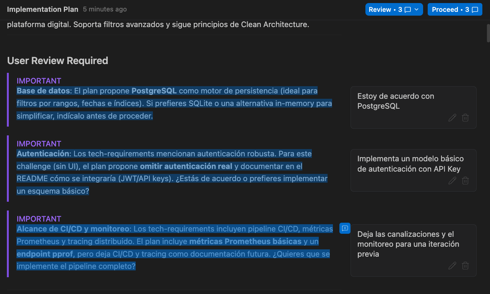
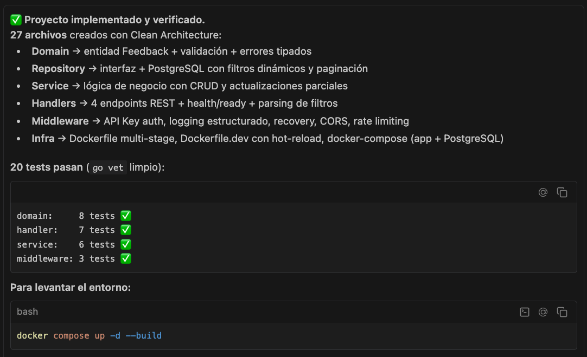
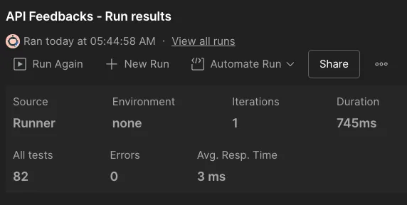
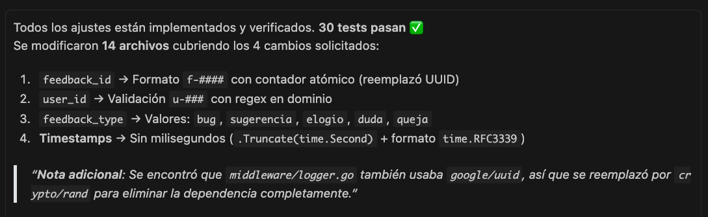
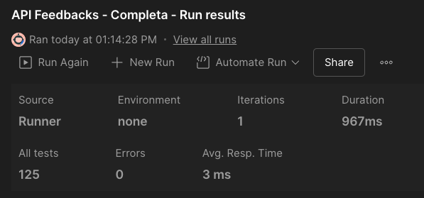

# Trazabilidad de prompts utilizados

# 1. ¿Qué prompts utilicé, cómo iteré y por qué?

En este documento se presentan los prompts utilizados para implementar el reto **"API de Feedbacks"**, usando el modelo **Claude Opus 4.6** como LLM y **Antigravity** como entorno de desarrollo asistido por IA. El proceso de desarrollo se organizó en iteraciones incrementales, las cuales se describen a continuación.

## Iteración 0: Preparación

### Tarea 1: Extraer información del reto en Markdown

El objetivo de esta tarea fue comprender el reto asignado y extraer la información relevante en formato Markdown, un formato que facilita el procesamiento por parte del agente de IA. Para esto utilicé el modelo **Gemini/Fast** con el siguiente prompt:

```markdown
Tu objetivo es extraer el texto del documento adjunto y devolver este texto en formato Markdown.

* El documento de salida debe estar en formato markdown para descargar.
* El documento de salida no debe contener las citas al documento adjunto.
* Debo poder descargar el documento, no quiero generes la respuesta en el chat, solo el archivo
```

El resultado obtenido corresponde al archivo [challenge-context.md](challenge-context.md).

### Tarea 2: Definición de lineamientos técnicos

En esta tarea utilicé la técnica de prompt engineering conocida como *Meta-prompting* para generar un prompt que me permitiera moldear el comportamiento del agente. La intención fue definir requerimientos técnicos, lineamientos y buenas prácticas para el desarrollo de la API. Para esta tarea utilicé el modelo **Sonnet 4.5** con el siguiente prompt:

```markdown
Actua como arquitecto de software experto en el desarrollo de microservicios Golang.

Tu objetivo es proporcionarme un prompt  con pautas concretas que defina los requerimientos técnicos, lineamientos y buenas prácticas relevantes que usará un agente de inteligencia artificial para desarrollar un microservicio.

Considera los siguientes puntos:
* El microservicio se debe contenerizar (Docker)
* El desarrollo se debe llevar a cabo en un contenedor de desarrollo
* Debe contemplar patrones de diseño acordes al microservicio que se va a desarrollar
* Debe contemplar buenas prácticas a nivel de rendimiento, seguridad, resiliencia y escalabilidad

Suministra las pautas de forma concreta, no incluyas ejemplos de código.

Presenta el contenido separado por secciones clave.

Entrega la respuesta en un archivo Markdown.
```

El prompt obtenido corresponde al archivo [.agent/rules/tech-requirements.md](../.agent/rules/tech-requirements.md).

### Tarea 3: Definir las reglas para el agente

Esta tarea inició con la creación de un workspace en Antigravity, con el propósito de contar con un espacio aislado y controlado donde el agente pudiera ejecutar sus operaciones. Para definir un comportamiento más específico, se agregaron las siguientes reglas al workspace:

- **docs_rules.md:** Se definieron reglas para que el agente documentara las decisiones técnicas tomadas durante la implementación en el archivo [tech-decisions.md](tech-decisions.md). Adicionalmente, se estableció que el agente registrara las recomendaciones o correcciones realizadas por el usuario en el archivo [corrections.md](corrections.md).
- **tech_requirements.md**: Se establecieron todos los requerimientos técnicos que debía seguir el agente para el desarrollo de la API. Estos lineamientos corresponden a los obtenidos en la tarea 2.

## Iteración 1: Desarrollo

Esta iteración inició con la creación de un repositorio Git para mantener el control de versiones del proyecto.

El primer prompt utilizado para iniciar el desarrollo fue el siguiente:

```markdown
Actúa como desarrollador experto en Golang.

Tu objetivo es analizar de forma exhaustiva el reto que se relaciona en el archivo challenge-context.md y definir el plan de implementación de acuerdo con los requerimientos técnicos definidos en @tech-requirements.md.
```

El propósito de este prompt fue que el agente realizara una planificación de tareas previa a la codificación, considerando tanto el contexto del reto como los lineamientos técnicos definidos en la iteración anterior.

Luego de revisar el plan de implementación generado, realicé las siguientes observaciones:



- **Sugerencia 1**: Recomendé el uso de **PostgreSQL** como base de datos para hacer la implementación más realista. Aunque la IA sugirió opciones más ligeras, opté por una solución más robusta y fiel a la realidad de los microservicios, dado que PostgreSQL garantiza consistencia (ACID), ofrece soporte nativo para JSON y posee características relevantes en rendimiento y escalabilidad.
- **Sugerencia 2**: Sugerí utilizar un modelo de **autenticación básico** para priorizar la funcionalidad en esta primera iteración y refinar la seguridad en fases posteriores.
- **Sugerencia 3**: Por la misma razón, consideré postergar las canalizaciones CI/CD y el monitoreo para una iteración futura.

Con estas sugerencias, el agente actualizó el plan de implementación, disponible en [implementation_plan.md](sessions/iteracion-1/implementation_plan.md). Una vez revisado el plan, autoricé al agente para que procediera con la implementación. Los resultados fueron los siguientes:



Con este resultado, procedí a levantar el contenedor y a realizar pruebas manuales con Postman. Tras verificar que el servicio respondía correctamente a las solicitudes definidas, decidí realizar una validación más exhaustiva, la cual se describe en la siguiente iteración.

## Iteración 2: Pruebas

Con la API funcional, me interesé en validar de forma más rigurosa su comportamiento para confirmar que cumplía con todos los requerimientos. Para ello, solicité al agente que generara una colección de Postman que cubriera todos los casos de uso del reto, incluyendo escenarios alternativos y de excepción. El prompt utilizado fue:

```markdown
Analiza el archivo challenge-context.md y crea una colección de postman que permita probar todos los escenarios propuestos.

Asegurate de incluir escenarios alternativos o de excepción.
```

La colección generada se encuentra en el archivo [API_Feedbacks.postman_collection.json](API_Feedbacks.postman_collection.json). Tras importarla en Postman y ejecutar las pruebas, se obtuvieron los siguientes resultados:



Los resultados detallados de las pruebas se encuentran en la carpeta [test-results/](test-results/).

Luego de confirmar que todos los casos fueron exitosos, validé manualmente algunos escenarios adicionales para corroborar el correcto funcionamiento de la API.

## Iteración 3: Mejoras

Si bien la API ya cumplía con los requerimientos del reto, quise llevar la implementación un paso más allá. Durante la validación manual con Postman, identifiqué que el formato de algunos campos difería de los ejemplos proporcionados en el archivo `feedbacks_sample_24.pdf`.

A continuación se presenta una comparación entre un registro de muestra y un registro retornado por la API en su primera versión:

```json
// Registro de muestra
{
  "feedback_id": "f-0001",
  "user_id": "u-001",
  "feedback_type": "elogio",
  "rating": 5,
  "comment": "La navegación es excelente. La interfaz es intuitiva y muy\nrápida.",
  "created_at": "2026-01-10T09:12:11Z",
  "updated_at": "2026-01-10T09:12:11Z"
}
// Registro retornado por la API
{
    "id": "5c20f496-9bff-4aa3-9707-7d7f8a232c5f",
    "user_id": "usr-003",
    "feedback_type": "question",
    "rating": 3,
    "comment": "¿Cómo puedo cambiar mi método de pago?",
    "created_at": "2026-02-10T10:44:58.350002Z",
    "updated_at": "2026-02-10T10:44:58.350002Z"
}
```

Las diferencias identificadas fueron las siguientes:
- `feedback_id`: formato diferente (`UUID` vs `f-####`).
- `user_id`: prefijo diferente (`usr-` vs `u-`).
- `feedback_type`: valores en inglés en lugar de español.
- `created_at` y `updated_at`: incluían milisegundos innecesarios.

Para corregir estas diferencias, utilicé la técnica de prompt engineering *few-shot*, proporcionando una instrucción junto con ejemplos concretos del formato esperado:

```json
Realiza los siguientes ajustes en el proyecto según corresponda:

* El campo feedback_id debe ser una cadena autogenerada con el formato "f_####".
* El campo user_id debe ser una cadena con el formato "u-###"
* Los valores permitidos para el campo "feedback_type" deben ser: bug, sugerencia, elogio, duda, queja.
* Los campos created_at y updated_at no deben incluir los milisegundos

Te presento algunos ejemplos de referencia, de como se deben ver los registros retornados, de acuerdo con los ajustes anteriores:

Ejemplo 1:
{"feedback_id":"f-0001","user_id":"u-001","feedback_type":"elogio","rating":5,"
comment":"La navegación es excelente. La interfaz es intuitiva y muy
rápida.","created_at":"2026-01-10T09:12:11Z","updated_at":"2026-01-10T09:12:11Z
"}

Ejemplo 2:
{"feedback_id":"f-0002","user_id":"u-011","feedback_type":"bug","rating":2,"com
ment":"Se desconecta cuando cambio de sección en la plataforma. A veces debo
hacer login otra
vez.","created_at":"2026-01-11T14:03:22Z","updated_at":"2026-01-11T14:03:22Z"}

Ejemplo 3:
{"feedback_id":"f-0003","user_id":"u-015","feedback_type":"queja","rating":1,"c
omment":"La verificación de dos pasos falla. Nunca recibo el código por
SMS.","created_at":"2026-01-12T18:44:05Z","updated_at":"2026-01-12T18:44:05Z"}

Condiciones:
* Modifica únicamente las partes del código que se vean afectadas por estos ajustes.
* Ajusta correspondientemente las pruebas y documentación.
```

El resultado obtenido fue el siguiente:



Adicionalmente, solicité que se regenerara la colección de Postman para validar que los ajustes fueran efectivos y que no se hubiera introducido ninguna regresión. Los resultados de esta segunda ejecución fueron:



Los resultados detallados de las pruebas se encuentran en la carpeta [test-results/](test-results/).

Por último, solicité algunas mejoras adicionales al agente:

- Mejorar la estructura y contenido del archivo `README.md`, corrigiendo algunas secciones.
- Utilizar como datos semilla los registros de muestra proporcionados en el archivo `feedbacks_sample_24.pdf`.
- Corregir comandos del `Makefile` que no estaban operativos (`make dev`, `make test`, `make test-cover` y `make lint`).

# 2. Ejemplos dónde validé o corregí a la IA

A lo largo del ejercicio, intervine activamente para validar, sugerir o corregir las propuestas de la IA. A continuación se presentan los casos más representativos:

| # | Tipo | Descripción | Referencia |
|---|------|-------------|------------|
| 1 | **Corrección** | La IA intentó ejecutar `go mod init` directamente en la máquina local. Indiqué que Go no está instalado y que todo el desarrollo debe realizarse dentro de contenedores Docker. | [CR-002](corrections.md) |
| 2 | **Sugerencia** | El plan inicial proponía omitir la autenticación y solo documentarla para el futuro. Solicité implementar un modelo básico con API Key para que la API fuera más realista. | [CR-001](corrections.md) |
| 3 | **Sugerencia** | La IA planteó implementar CI/CD y monitoreo completo en la primera iteración. Recomendé diferirlos para priorizar la funcionalidad de la API. | [CR-003](corrections.md) |
| 4 | **Sugerencia** | Recomendé utilizar **PostgreSQL** como base de datos en lugar de opciones más ligeras sugeridas por la IA, para hacer la implementación más fiel a la realidad de los microservicios. | [Iteración 1 — Sugerencia 1](#iteración-1-desarrollo) |
| 5 | **Validación** | Tras la primera implementación, levanté el contenedor y realicé pruebas manuales con Postman para verificar que el servicio respondía correctamente antes de avanzar. | [Iteración 1 — Resultado](#iteración-1-desarrollo) |
| 6 | **Corrección** | Identifiqué manualmente que los formatos de `feedback_id`, `user_id`, `feedback_type` y timestamps no coincidían con los ejemplos del archivo de muestra. Proporcioné ejemplos concretos (few-shot) para corregir el comportamiento. | [Iteración 3 — Mejoras](#iteración-3-mejoras) |
| 7 | **Validación** | Solicité regenerar la colección de Postman después de los ajustes de la iteración 3 para confirmar que no se introdujeron regresiones. | [Iteración 3 — Postman](#iteración-3-mejoras) |
| 8 | **Corrección** | Detecté que los comandos `make dev`, `make test`, `make test-cover` y `make lint` no funcionaban correctamente, lo que llevó a la actualización de Go 1.23 → 1.24 y al pinning de `air`. | [TD-014](tech-decisions.md) |

# 3. Decisiones y trade-offs

Las principales decisiones técnicas tomadas durante el ejercicio se resumen a continuación. Cada una implicó un trade-off consciente entre complejidad, tiempo y fidelidad al contexto del reto.

| Decisión | Trade-off | Justificación |
|----------|-----------|---------------|
| **PostgreSQL** como BD (TD-001) | Mayor complejidad de infraestructura vs. opciones in-memory | Consistencia ACID, filtros por rangos e índices compuestos; más representativo de un entorno real. |
| **API Key** para autenticación (TD-002) | Seguridad básica vs. OAuth2/JWT completo | Suficiente para proteger endpoints y demostrar el patrón de seguridad sin complejidad adicional. |
| **CI/CD y monitoreo diferidos** (TD-003) | Menor cobertura de infraestructura vs. entrega más rápida | Se priorizó calidad del código, testing y documentación sobre automatización de despliegue. |
| **Clean Architecture** (TD-006) | Mayor cantidad de archivos y capas vs. diseño monolítico | Facilita testing con mocks, baja dependencia entre componentes y cumple principios SOLID. |
| **IDs secuenciales `f-####`** (TD-008) | Predicibilidad vs. unicidad global de UUID | IDs legibles y alineados con el formato de muestra. Para producción multi-instancia, se migraría a secuencias PostgreSQL. |
| **Feedback types en español** (TD-010) | Consistencia con dominio de negocio vs. convención técnica en inglés | Alinea valores del sistema con los datos de muestra. Se mantiene `bug` como término universal. |
| **Timestamps sin milisegundos** (TD-011) | Menor precisión vs. formato más limpio | Coincide con el formato de muestra; precisión a segundos es suficiente para el caso de uso. |
| **Seed script dinámico** (TD-013) | Dependencia de `jq` vs. datos hardcodeados | Centraliza datos semilla en un archivo JSON, facilitando mantenimiento y sincronización. |
| **Actualización a Go 1.24** (TD-014) | Versión más reciente vs. estabilidad de 1.23 | Necesaria por compatibilidad con `air`. Se agregó pinning de dependencias y perfiles Docker Compose. |

# 4. Anexos

Todas las interacciones con el agente se encuentran en la carpeta [sessions/](sessions/). A continuación se presentan los archivos relevantes:

### Iteración 1 — Desarrollo

| Archivo | Descripción |
|---------|-------------|
| [Golang API Feedbacks.md](sessions/iteracion-1/Golang%20API%20Feedbacks.md) | Conversación principal del desarrollo de la API |
| [implementation_plan.md](sessions/iteracion-1/implementation_plan.md) | Plan de implementación aprobado |
| [task.md](sessions/iteracion-1/task.md) | Checklist de tareas de la iteración |
| [walkthrough.md](sessions/iteracion-1/walkthrough.md) | Resumen de lo implementado y verificado |

### Iteración 2 — Pruebas

| Archivo | Descripción |
|---------|-------------|
| [Postman Collection for API.md](sessions/iteracion-2/Postman%20Collection%20for%20API.md) | Generación de la colección Postman inicial |

### Iteración 3 — Mejoras

| Archivo | Descripción |
|---------|-------------|
| [Adjusting Feedback API Formats.md](sessions/iteracion-3/Adjusting%20Feedback%20API%20Formats.md) | Ajustes de formatos (`feedback_id`, `user_id`, timestamps) |
| [Creating Postman Collection.md](sessions/iteracion-3/Creating%20Postman%20Collection.md) | Regeneración de la colección Postman post-ajustes |
| [Validating OpenAPI Specification.md](sessions/iteracion-3/Validating%20OpenAPI%20Specification.md) | Validación del archivo `openapi.yaml` |
| [Modifying Seed Script.md](sessions/iteracion-3/Modifying%20Seed%20Script.md) | Modificación del script de datos semilla |
| [Validating Makefile Commands.md](sessions/iteracion-3/Validating%20Makefile%20Commands.md) | Corrección de comandos del Makefile |