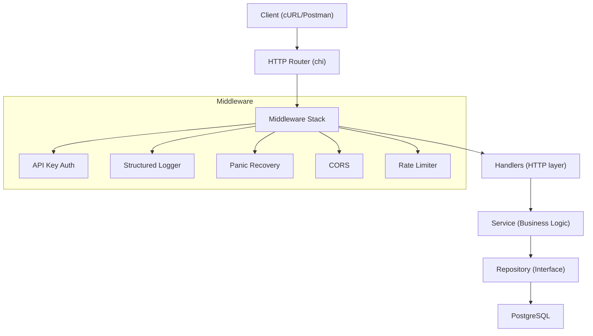

# Plan de Implementación — API Feedbacks en Golang

API REST en Go para capturar, actualizar y consultar feedbacks de usuarios sobre la plataforma digital. Soporta filtros avanzados y sigue principios de Clean Architecture.

---

## Decisiones Aprobadas

- ✅ **Base de datos**: PostgreSQL
- ✅ **Autenticación**: API Key básica vía header `X-API-Key`
- ✅ **CI/CD y monitoreo**: Diferidos a iteración futura

---

## Propuesta de Arquitectura



---

## Estructura de Directorios

```
api-feedbacks/
├── cmd/
│   └── server/
│       └── main.go                  # Entry point, bootstrap
├── internal/
│   ├── config/
│   │   └── config.go                # Env-based configuration
│   ├── domain/
│   │   ├── feedback.go              # Entity + value objects
│   │   └── errors.go                # Domain error hierarchy
│   ├── service/
│   │   └── feedback_service.go      # Business logic + interface
│   ├── repository/
│   │   ├── postgres/
│   │   │   ├── feedback_repo.go     # PostgreSQL implementation
│   │   │   └── migrations/
│   │   │       └── 001_create_feedbacks.sql
│   │   └── repository.go            # Repository interface
│   ├── handler/
│   │   ├── feedback_handler.go      # HTTP handlers
│   │   ├── dto.go                   # Request/Response DTOs
│   │   └── router.go                # Route definitions
│   └── middleware/
│       ├── auth.go
│       ├── logger.go
│       ├── recovery.go
│       ├── cors.go
│       └── ratelimit.go
├── pkg/
│   └── response/
│       └── response.go              # Standardized JSON responses
├── docs/
│   └── openapi.yaml                 # OpenAPI 3.0 spec
├── scripts/
│   ├── seed.sh                      # Sample data seeding
│   └── test.sh                      # Run all tests
├── Dockerfile                       # Multi-stage build
├── Dockerfile.dev                   # Dev container with hot-reload
├── docker-compose.yml               # App + PostgreSQL + pgAdmin
├── .env.example
├── go.mod
├── go.sum
├── README.md
├── PROMPTS.md
└── Makefile
```

---

## Proposed Changes

### Dominio

#### [NEW] [feedback.go](file:///Users/dev/.gemini/antigravity/scratch/api-feedbacks/internal/domain/feedback.go)

Entidad `Feedback` con campos:
- `ID` (UUID, generado por el servidor)
- `UserID` (string, requerido)
- `FeedbackType` (enum: `bug`, `suggestion`, `praise`, `question`)
- `Rating` (int, 1–5, con validación)
- `Comment` (string, requerido, máx 2000 chars)
- `CreatedAt`, `UpdatedAt` (time.Time, gestionados automáticamente)

Métodos de validación en la entidad (`Validate()`) que retornan errores de dominio.

#### [NEW] [errors.go](file:///Users/dev/.gemini/antigravity/scratch/api-feedbacks/internal/domain/errors.go)

Jerarquía de errores de dominio:
- `ErrNotFound` — feedback no encontrado
- `ErrValidation` — error de validación con campo y detalle
- `ErrConflict` — conflicto de datos
- `ErrInternal` — error interno inesperado

---

### Repositorio

#### [NEW] [repository.go](file:///Users/dev/.gemini/antigravity/scratch/api-feedbacks/internal/repository/repository.go)

Interfaz `FeedbackRepository`:
```go
type FeedbackFilter struct {
    UserID       *string
    FeedbackType *string
    MinRating    *int
    MaxRating    *int
    CreatedFrom  *time.Time
    CreatedTo    *time.Time
    Limit        int    // default 20, max 100
    Offset       int
}

type FeedbackRepository interface {
    Create(ctx context.Context, f *domain.Feedback) error
    GetByID(ctx context.Context, id string) (*domain.Feedback, error)
    Update(ctx context.Context, f *domain.Feedback) error
    List(ctx context.Context, filter FeedbackFilter) ([]*domain.Feedback, int, error)
}
```

#### [NEW] [feedback_repo.go](file:///Users/dev/.gemini/antigravity/scratch/api-feedbacks/internal/repository/postgres/feedback_repo.go)

Implementación PostgreSQL del repositorio:
- Connection pool con `pgxpool`
- Construcción dinámica de queries con filtros (prepared statements, sin SQL injection)
- `COUNT` separado para paginación
- Índices en `user_id`, `feedback_type`, `rating`, `created_at`

#### [NEW] [001_create_feedbacks.sql](file:///Users/dev/.gemini/antigravity/scratch/api-feedbacks/internal/repository/postgres/migrations/001_create_feedbacks.sql)

```sql
CREATE TABLE IF NOT EXISTS feedbacks (
    id          UUID PRIMARY KEY DEFAULT gen_random_uuid(),
    user_id     VARCHAR(255) NOT NULL,
    feedback_type VARCHAR(50) NOT NULL CHECK (feedback_type IN ('bug','suggestion','praise','question')),
    rating      INTEGER NOT NULL CHECK (rating >= 1 AND rating <= 5),
    comment     TEXT NOT NULL,
    created_at  TIMESTAMPTZ NOT NULL DEFAULT NOW(),
    updated_at  TIMESTAMPTZ NOT NULL DEFAULT NOW()
);

CREATE INDEX idx_feedbacks_user_id ON feedbacks(user_id);
CREATE INDEX idx_feedbacks_type ON feedbacks(feedback_type);
CREATE INDEX idx_feedbacks_rating ON feedbacks(rating);
CREATE INDEX idx_feedbacks_created_at ON feedbacks(created_at);
```

---

### Servicio

#### [NEW] [feedback_service.go](file:///Users/dev/.gemini/antigravity/scratch/api-feedbacks/internal/service/feedback_service.go)

Interfaz `FeedbackService` + implementación concreta:
- `Create(ctx, input)` — valida, genera UUID, establece timestamps, persiste
- `GetByID(ctx, id)` — busca por ID, retorna error tipado si no existe
- `Update(ctx, id, input)` — actualiza parcial (solo campos enviados), actualiza `updated_at`
- `List(ctx, filter)` — delega al repositorio, retorna lista + total count para paginación

Toda lógica de negocio aquí, no en handlers ni repositorio.

---

### Handlers HTTP

#### [NEW] [feedback_handler.go](file:///Users/dev/.gemini/antigravity/scratch/api-feedbacks/internal/handler/feedback_handler.go)

| Método | Ruta | Descripción |
|--------|------|-------------|
| `POST` | `/api/v1/feedbacks` | Crear feedback |
| `GET` | `/api/v1/feedbacks/{id}` | Obtener feedback por ID |
| `PATCH` | `/api/v1/feedbacks/{id}` | Actualizar feedback parcial |
| `GET` | `/api/v1/feedbacks` | Listar feedbacks con filtros |
| `GET` | `/health` | Health check |
| `GET` | `/ready` | Readiness probe |

**Filtros vía query params en `GET /api/v1/feedbacks`:**
```
?user_id=usr123
&feedback_type=bug
&min_rating=3
&max_rating=5
&created_from=2026-01-01T00:00:00Z
&created_to=2026-02-01T00:00:00Z
&limit=20
&offset=0
```

#### [NEW] [dto.go](file:///Users/dev/.gemini/antigravity/scratch/api-feedbacks/internal/handler/dto.go)

DTOs de request/response separados del modelo de dominio:
- `CreateFeedbackRequest` — con tags de JSON y validación
- `UpdateFeedbackRequest` — campos opcionales (punteros)
- `FeedbackResponse` — formato de salida estandarizado
- `ListResponse` — wrapper con `data`, `total`, `limit`, `offset`

#### [NEW] [router.go](file:///Users/dev/.gemini/antigravity/scratch/api-feedbacks/internal/handler/router.go)

Setup del router `chi` con middleware stack y montaje de rutas.

---

### Middleware

#### [NEW] [auth.go](file:///Users/dev/.gemini/antigravity/scratch/api-feedbacks/internal/middleware/auth.go)
Validación de API Key vía header `X-API-Key`. Compara contra valor configurado en variable de entorno `API_KEY`. Retorna `401 Unauthorized` si falta o es inválida. Excluye rutas públicas (`/health`, `/ready`).

#### [NEW] [logger.go](file:///Users/dev/.gemini/antigravity/scratch/api-feedbacks/internal/middleware/logger.go)
Logging estructurado con `slog` (stdlib): método, ruta, status, latencia, request ID.

#### [NEW] [recovery.go](file:///Users/dev/.gemini/antigravity/scratch/api-feedbacks/internal/middleware/recovery.go)
Recovery de panics sin caer el servidor, loguea stacktrace.

#### [NEW] [cors.go](file:///Users/dev/.gemini/antigravity/scratch/api-feedbacks/internal/middleware/cors.go)
CORS configurable vía variables de entorno.

#### [NEW] [ratelimit.go](file:///Users/dev/.gemini/antigravity/scratch/api-feedbacks/internal/middleware/ratelimit.go)
Rate limiter por IP usando `golang.org/x/time/rate`.

---

### Respuestas Estándar

#### [NEW] [response.go](file:///Users/dev/.gemini/antigravity/scratch/api-feedbacks/pkg/response/response.go)

```go
// Respuesta exitosa
{ "success": true, "data": {...}, "meta": {"total": 50, "limit": 20, "offset": 0} }

// Respuesta de error
{ "success": false, "error": {"code": "VALIDATION_ERROR", "message": "...", "details": [...]} }
```

---

### Configuración

#### [NEW] [config.go](file:///Users/dev/.gemini/antigravity/scratch/api-feedbacks/internal/config/config.go)

Lectura de variables de entorno con valores por defecto:
- `SERVER_PORT` (default `8080`)
- `DATABASE_URL` (requerida)
- `API_KEY` (requerida — clave para autenticación)
- `LOG_LEVEL` (default `info`)
- `CORS_ORIGINS` (default `*`)
- `RATE_LIMIT_RPS` (default `100`)

Validación al inicio; fallo rápido si falta configuración requerida.

---

### Entry Point

#### [NEW] [main.go](file:///Users/dev/.gemini/antigravity/scratch/api-feedbacks/cmd/server/main.go)

Bootstrap:
1. Cargar configuración
2. Conectar a PostgreSQL con pool
3. Ejecutar migraciones
4. Instanciar repositorio → servicio → handlers
5. Montar router con middleware
6. Iniciar HTTP server con graceful shutdown (`signal.Notify` + `server.Shutdown`)

---

### Infraestructura

#### [NEW] [Dockerfile](file:///Users/dev/.gemini/antigravity/scratch/api-feedbacks/Dockerfile)

Multi-stage build:
1. **Builder**: `golang:1.23-alpine` — compila binario estático con `-ldflags="-s -w"`
2. **Runtime**: `alpine:3.19` — usuario no-root, copia solo el binario, expone puerto

#### [NEW] [Dockerfile.dev](file:///Users/dev/.gemini/antigravity/scratch/api-feedbacks/Dockerfile.dev)

Contenedor de desarrollo con `air` para hot-reload.

#### [NEW] [docker-compose.yml](file:///Users/dev/.gemini/antigravity/scratch/api-feedbacks/docker-compose.yml)

Servicios:
- **app**: la API (puerto 8080)
- **db**: PostgreSQL 16 (puerto 5432, volumen persistente)
- Health checks, depends_on, restart policies

#### [NEW] [.env.example](file:///Users/dev/.gemini/antigravity/scratch/api-feedbacks/.env.example)

Variables de entorno documentadas con valores de ejemplo.

#### [NEW] [Makefile](file:///Users/dev/.gemini/antigravity/scratch/api-feedbacks/Makefile)

Targets: `run`, `dev`, `test`, `lint`, `build`, `docker-up`, `docker-down`, `migrate`, `seed`.

---

### Documentación

#### [NEW] [README.md](file:///Users/dev/.gemini/antigravity/scratch/api-feedbacks/README.md)

- Descripción del proyecto y arquitectura
- Requisitos previos (Go 1.23+, Docker, Docker Compose)
- Instrucciones de ejecución (local y Docker)
- Listado y descripción de endpoints
- Ejemplos cURL para cada operación
- Decisiones técnicas justificadas
- Bibliotecas externas con justificación

#### [NEW] [PROMPTS.md](file:///Users/dev/.gemini/antigravity/scratch/api-feedbacks/PROMPTS.md)

Trazabilidad del uso de IA: prompts, iteraciones, validaciones y decisiones.

#### [NEW] [openapi.yaml](file:///Users/dev/.gemini/antigravity/scratch/api-feedbacks/docs/openapi.yaml)

Especificación OpenAPI 3.0 completa con schemas, ejemplos y códigos de error.

---

## Dependencias Externas (justificadas)

| Paquete | Propósito | Justificación |
|---------|-----------|---------------|
| `github.com/go-chi/chi/v5` | HTTP router | Ligero, idiomatic Go, middleware composable, compatible stdlib |
| `github.com/jackc/pgx/v5` | Driver PostgreSQL | Mayor rendimiento que `lib/pq`, soporte nativo pgxpool |
| `github.com/google/uuid` | Generación UUID | Estándar, generación UUID v4 para IDs de feedback |
| `golang.org/x/time/rate` | Rate limiting | Paquete oficial Go, token bucket algorithm |
| `github.com/stretchr/testify` | Testing assertions | Assertions expresivas, suite de tests, mocks |

---

## Verification Plan

### Automated Tests

#### Unit Tests
Tests para la capa de servicio mockeando el repositorio, y tests de handlers usando `httptest` del stdlib.

```bash
# Ejecutar todos los tests unitarios
go test ./internal/... -v -count=1

# Con cobertura
go test ./internal/... -v -coverprofile=coverage.out
go tool cover -html=coverage.out
```

**Cobertura mínima objetivo: 80%** en `service/` y `handler/`.

#### Integration Tests
Tests del repositorio PostgreSQL usando un contenedor PostgreSQL de test (testcontainers-go o un servicio Docker Compose de test).

```bash
# Ejecutar tests de integración (requiere Docker corriendo)
go test ./internal/repository/... -v -tags=integration -count=1
```

### Manual Verification

Verificación manual con Docker Compose y cURL. Estos pasos asumen que Docker está instalado y corriendo.

**1. Levantar el entorno:**
```bash
cd /Users/dev/.gemini/antigravity/scratch/api-feedbacks
docker compose up -d --build
```

**2. Verificar health check:**
```bash
curl -s http://localhost:8080/health | jq .
# Esperado: {"status": "ok"}
```

**3. Crear un feedback:**
```bash
curl -s -X POST http://localhost:8080/api/v1/feedbacks \
  -H "Content-Type: application/json" \
  -H "X-API-Key: my-secret-api-key" \
  -d '{
    "user_id": "usr-001",
    "feedback_type": "bug",
    "rating": 3,
    "comment": "El botón de pago no responde en Safari"
  }' | jq .
# Esperado: 201 Created con el feedback creado y su ID
```

**4. Consultar feedbacks con filtros:**
```bash
curl -s -H "X-API-Key: my-secret-api-key" \
  "http://localhost:8080/api/v1/feedbacks?feedback_type=bug&min_rating=1&max_rating=3" | jq .
# Esperado: lista paginada con el feedback creado
```

**5. Actualizar un feedback** (usar el ID del paso 3):
```bash
curl -s -X PATCH http://localhost:8080/api/v1/feedbacks/{ID} \
  -H "Content-Type: application/json" \
  -H "X-API-Key: my-secret-api-key" \
  -d '{"rating": 4, "comment": "Se resolvió parcialmente"}' | jq .
# Esperado: 200 OK con feedback actualizado y updated_at cambiado
```

**6. Validación de errores:**
```bash
# Sin API Key → 401 Unauthorized
curl -s -X POST http://localhost:8080/api/v1/feedbacks \
  -H "Content-Type: application/json" \
  -d '{"user_id": "usr-001", "feedback_type": "bug", "rating": 3, "comment": "test"}' | jq .
# Esperado: 401 Unauthorized

# Rating fuera de rango
curl -s -X POST http://localhost:8080/api/v1/feedbacks \
  -H "Content-Type: application/json" \
  -H "X-API-Key: my-secret-api-key" \
  -d '{"user_id": "usr-001", "feedback_type": "bug", "rating": 7, "comment": "test"}' | jq .
# Esperado: 400 Bad Request con detalle de validación

# Feedback no encontrado
curl -s -H "X-API-Key: my-secret-api-key" \
  http://localhost:8080/api/v1/feedbacks/non-existent-id | jq .
# Esperado: 404 Not Found
```

**7. Apagar el entorno:**
```bash
docker compose down -v
```
